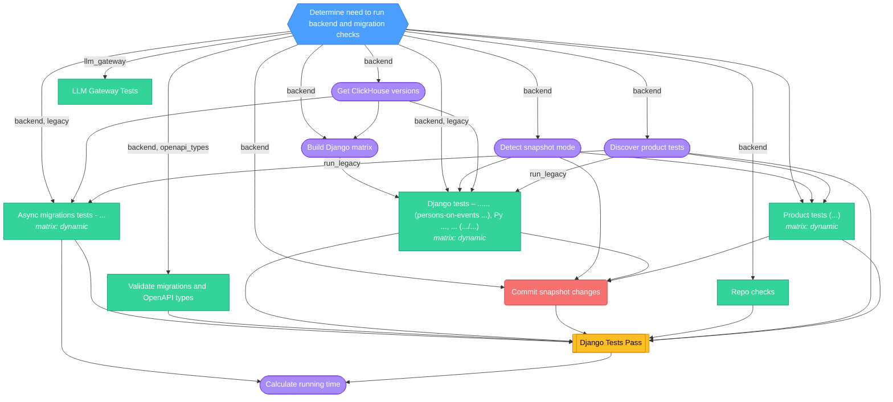

<!-- This file is auto-generated by bin/generate-ci-diagrams.py. Do not edit manually. -->

# Backend CI (`ci-backend.yml`)

**Triggers**: `merge_group`, `pull_request`, `push`, `workflow_dispatch`

## Legend

| Shape        | Color  | Meaning                   |
| ------------ | ------ | ------------------------- |
| Hexagon      | Blue   | Gate / change detection   |
| Stadium      | Purple | Plumbing / matrix builder |
| Rectangle    | Green  | Test / core work          |
| Subroutine   | Yellow | Collation / status gate   |
| Rounded rect | Red    | Side effect / snapshots   |

Edge labels show the change-detection output that gates the job.

## Job details

| Job                       | Depends on                                                                                             | Condition                                                                                                                                                                                                                                | Matrix  |
| ------------------------- | ------------------------------------------------------------------------------------------------------ | ---------------------------------------------------------------------------------------------------------------------------------------------------------------------------------------------------------------------------------------- | ------- |
| `changes`                 | -                                                                                                      | -                                                                                                                                                                                                                                        | -       |
| `check-migrations`        | changes                                                                                                | backend \|\| openapi_types                                                                                                                                                                                                               | -       |
| `detect-snapshot-mode`    | changes                                                                                                | backend                                                                                                                                                                                                                                  | -       |
| `get_clickhouse_versions` | changes                                                                                                | backend                                                                                                                                                                                                                                  | -       |
| `build_django_matrix`     | changes, get_clickhouse_versions                                                                       | backend                                                                                                                                                                                                                                  | -       |
| `llm-gateway`             | changes                                                                                                | llm_gateway                                                                                                                                                                                                                              | -       |
| `repo-checks`             | changes                                                                                                | backend                                                                                                                                                                                                                                  | -       |
| `turbo-discover`          | changes                                                                                                | backend                                                                                                                                                                                                                                  | -       |
| `async-migrations`        | changes, turbo-discover, get_clickhouse_versions                                                       | backend && (legacy \|\| run_legacy \|\| (needs.turbo-discover.result != 'success' && needs.turbo-discover.result != 'skipped'))                                                                                                          | dynamic |
| `django`                  | changes, turbo-discover, detect-snapshot-mode, get_clickhouse_versions, build_django_matrix            | backend && needs.build_django_matrix.result == 'success' && (legacy \|\| run_legacy \|\| (needs.turbo-discover.result != 'success' && needs.turbo-discover.result != 'skipped'))                                                         | dynamic |
| `turbo-tests`             | changes, turbo-discover, detect-snapshot-mode                                                          | needs.turbo-discover.result == 'success' && needs.turbo-discover.outputs.matrix != '[]' && needs.turbo-discover.outputs.matrix != ''                                                                                                     | dynamic |
| `handle-snapshots`        | changes, detect-snapshot-mode, django, turbo-tests                                                     | needs.detect-snapshot-mode.outputs.mode == 'update' && backend && github.event.pull_request.head.repo.full_name == 'PostHog/posthog'                                                                                                     | -       |
| `django_tests`            | django, check-migrations, async-migrations, turbo-discover, turbo-tests, handle-snapshots, repo-checks | -                                                                                                                                                                                                                                        | -       |
| `calculate-running-time`  | django_tests, async-migrations                                                                         | github.actor != 'dependabot[bot]' && ( (github.event_name == 'pull_request' && github.event.pull_request.head.repo.full_name == 'PostHog/posthog') \|\| (github.event_name != 'pull_request' && github.repository == 'PostHog/posthog')) | -       |
