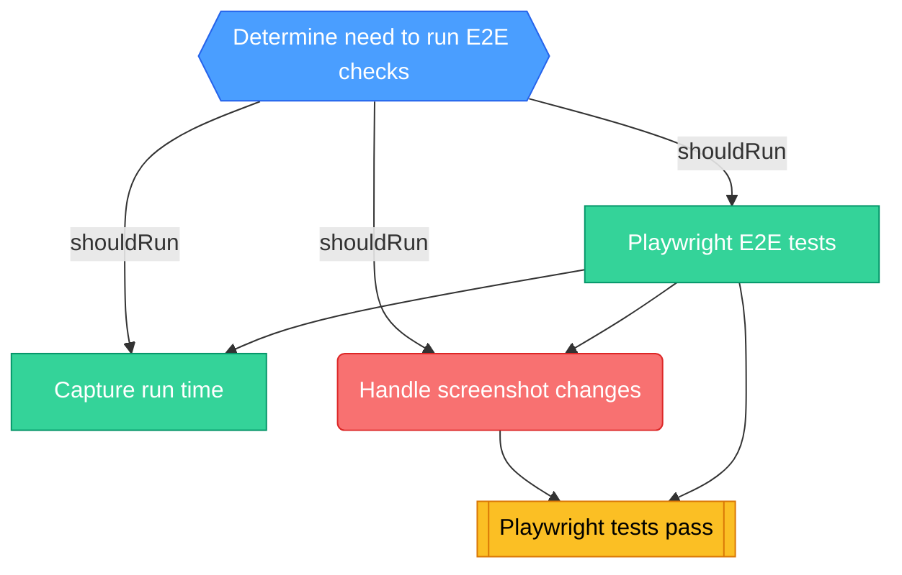

<!-- This file is auto-generated by bin/generate-ci-diagrams.py. Do not edit manually. -->

# E2E CI Playwright (`ci-e2e-playwright.yml`)

**Triggers**: `pull_request`, `push`, `workflow_dispatch`

## Legend

| Shape        | Color  | Meaning                   |
| ------------ | ------ | ------------------------- |
| Hexagon      | Blue   | Gate / change detection   |
| Stadium      | Purple | Plumbing / matrix builder |
| Rectangle    | Green  | Test / core work          |
| Subroutine   | Yellow | Collation / status gate   |
| Rounded rect | Red    | Side effect / snapshots   |

Edge labels show the change-detection output that gates the job.

## Job details

| Job                  | Depends on                     | Condition                                                                                                                                                                                                                                             | Matrix |
| -------------------- | ------------------------------ | ----------------------------------------------------------------------------------------------------------------------------------------------------------------------------------------------------------------------------------------------------- | ------ |
| `changes`            | -                              | github.event_name == 'push' \|\| github.event.pull_request.head.repo.full_name == github.repository                                                                                                                                                   | -      |
| `playwright`         | changes                        | shouldRun                                                                                                                                                                                                                                             | -      |
| `capture-run-time`   | changes, playwright            | github.actor != 'dependabot[bot]' && shouldRun && ( (github.event_name == 'pull_request' && github.event.pull_request.head.repo.full_name == 'PostHog/posthog') \|\| (github.event_name != 'pull_request' && github.repository == 'PostHog/posthog')) | -      |
| `handle-screenshots` | playwright, changes            | needs.changes.outputs.mode == 'update' && shouldRun && github.event.pull_request.head.repo.full_name == github.repository                                                                                                                             | -      |
| `playwright_tests`   | playwright, handle-screenshots | -                                                                                                                                                                                                                                                     | -      |
