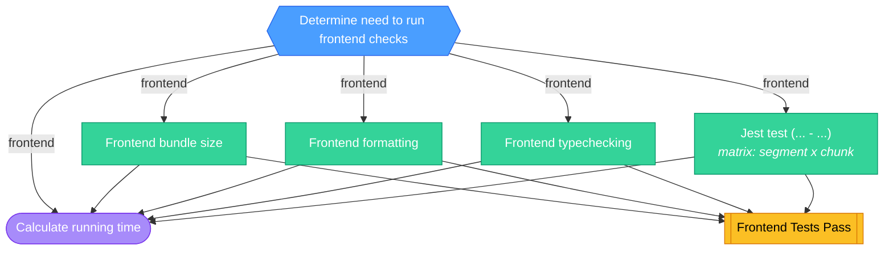

<!-- This file is auto-generated by bin/generate-ci-diagrams.py. Do not edit manually. -->

# Frontend CI (`ci-frontend.yml`)

**Triggers**: `merge_group`, `pull_request`, `push`

## Legend

| Shape        | Color  | Meaning                   |
| ------------ | ------ | ------------------------- |
| Hexagon      | Blue   | Gate / change detection   |
| Stadium      | Purple | Plumbing / matrix builder |
| Rectangle    | Green  | Test / core work          |
| Subroutine   | Yellow | Collation / status gate   |
| Rounded rect | Red    | Side effect / snapshots   |

Edge labels show the change-detection output that gates the job.

## Job details

| Job                          | Depends on                                                                       | Condition                                                                                                                                                                                                                                            | Matrix          |
| ---------------------------- | -------------------------------------------------------------------------------- | ---------------------------------------------------------------------------------------------------------------------------------------------------------------------------------------------------------------------------------------------------- | --------------- |
| `changes`                    | -                                                                                | -                                                                                                                                                                                                                                                    | -               |
| `frontend-bundle-size`       | changes                                                                          | frontend && github.event_name != 'merge_group'                                                                                                                                                                                                       | -               |
| `frontend-format`            | changes                                                                          | frontend                                                                                                                                                                                                                                             | -               |
| `frontend-typescript-checks` | changes                                                                          | frontend                                                                                                                                                                                                                                             | -               |
| `jest`                       | changes                                                                          | frontend                                                                                                                                                                                                                                             | segment x chunk |
| `calculate-running-time`     | jest, frontend-typescript-checks, frontend-format, frontend-bundle-size, changes | github.actor != 'dependabot[bot]' && frontend && ( (github.event_name == 'pull_request' && github.event.pull_request.head.repo.full_name == 'PostHog/posthog') \|\| (github.event_name != 'pull_request' && github.repository == 'PostHog/posthog')) | -               |
| `frontend_tests`             | jest, frontend-format, frontend-bundle-size, frontend-typescript-checks          | -                                                                                                                                                                                                                                                    | -               |
