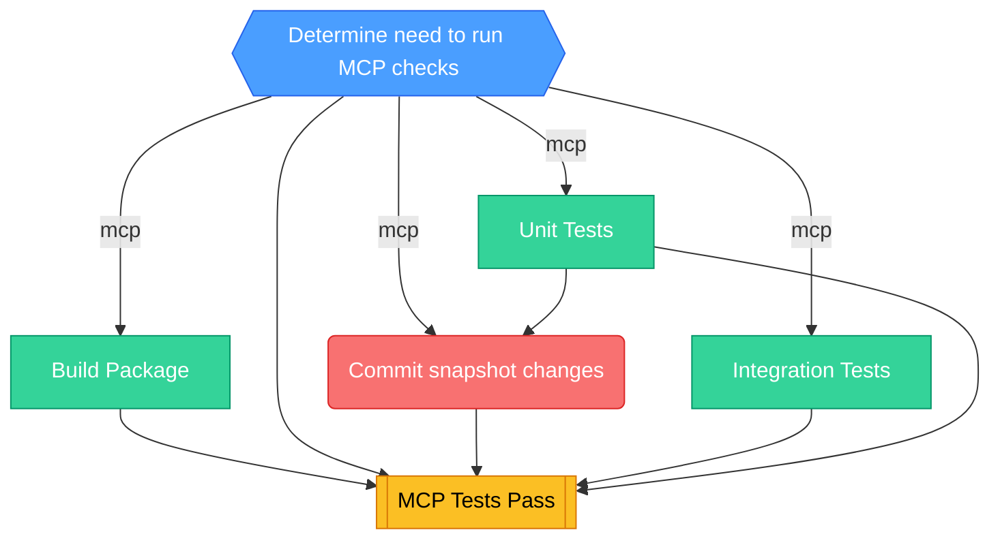

<!-- This file is auto-generated by bin/generate-ci-diagrams.py. Do not edit manually. -->

# MCP CI (`ci-mcp.yml`)

**Triggers**: `pull_request`, `push`

## Legend

| Shape        | Color  | Meaning                   |
| ------------ | ------ | ------------------------- |
| Hexagon      | Blue   | Gate / change detection   |
| Stadium      | Purple | Plumbing / matrix builder |
| Rectangle    | Green  | Test / core work          |
| Subroutine   | Yellow | Collation / status gate   |
| Rounded rect | Red    | Side effect / snapshots   |

Edge labels show the change-detection output that gates the job.

## Job details

| Job                 | Depends on                                                      | Condition                                                                                                                                                                                                                          | Matrix |
| ------------------- | --------------------------------------------------------------- | ---------------------------------------------------------------------------------------------------------------------------------------------------------------------------------------------------------------------------------- | ------ |
| `changes`           | -                                                               | -                                                                                                                                                                                                                                  | -      |
| `build`             | changes                                                         | mcp                                                                                                                                                                                                                                | -      |
| `integration-tests` | changes                                                         | mcp                                                                                                                                                                                                                                | -      |
| `unit-tests`        | changes                                                         | mcp                                                                                                                                                                                                                                | -      |
| `handle-snapshots`  | changes, unit-tests                                             | mcp && github.event_name == 'pull_request' && github.event.pull_request.head.repo.full_name == github.repository && !contains(github.actor, '[bot]') && github.actor != 'posthog-bot' && !contains(github.actor, 'github-actions') | -      |
| `mcp_tests`         | changes, build, unit-tests, integration-tests, handle-snapshots | -                                                                                                                                                                                                                                  | -      |
