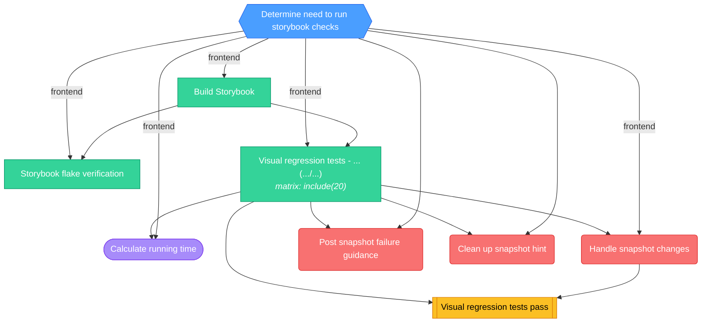

<!-- This file is auto-generated by bin/generate-ci-diagrams.py. Do not edit manually. -->

# Storybook (`ci-storybook.yml`)

**Triggers**: `merge_group`, `pull_request`, `push`

## Legend

| Shape        | Color  | Meaning                   |
| ------------ | ------ | ------------------------- |
| Hexagon      | Blue   | Gate / change detection   |
| Stadium      | Purple | Plumbing / matrix builder |
| Rectangle    | Green  | Test / core work          |
| Subroutine   | Yellow | Collation / status gate   |
| Rounded rect | Red    | Side effect / snapshots   |

Edge labels show the change-detection output that gates the job.

## Job details

| Job                        | Depends on                          | Condition                                                                                                                                                                                                                                            | Matrix      |
| -------------------------- | ----------------------------------- | ---------------------------------------------------------------------------------------------------------------------------------------------------------------------------------------------------------------------------------------------------- | ----------- |
| `changes`                  | -                                   | github.event_name != 'merge_group'                                                                                                                                                                                                                   | -           |
| `build-storybook`          | changes                             | frontend                                                                                                                                                                                                                                             | -           |
| `flake-verification`       | changes, build-storybook            | frontend && github.event_name == 'pull_request'                                                                                                                                                                                                      | -           |
| `visual-regression`        | changes, build-storybook            | frontend                                                                                                                                                                                                                                             | include(20) |
| `calculate-running-time`   | visual-regression, changes          | github.actor != 'dependabot[bot]' && frontend && ( (github.event_name == 'pull_request' && github.event.pull_request.head.repo.full_name == 'PostHog/posthog') \|\| (github.event_name != 'pull_request' && github.repository == 'PostHog/posthog')) | -           |
| `handle-snapshots`         | visual-regression, changes          | needs.changes.outputs.mode == 'update' && frontend && github.event.pull_request.head.repo.full_name == github.repository                                                                                                                             | -           |
| `snapshot-failure-comment` | visual-regression, changes          | needs.visual-regression.result == 'failure' && needs.changes.outputs.mode == 'check' && github.event_name == 'pull_request' && github.event.pull_request.head.repo.full_name == github.repository                                                    | -           |
| `snapshot-success-cleanup` | visual-regression, changes          | needs.visual-regression.result == 'success' && github.event_name == 'pull_request' && github.event.pull_request.head.repo.full_name == github.repository                                                                                             | -           |
| `visual_regression_tests`  | visual-regression, handle-snapshots | -                                                                                                                                                                                                                                                    | -           |
