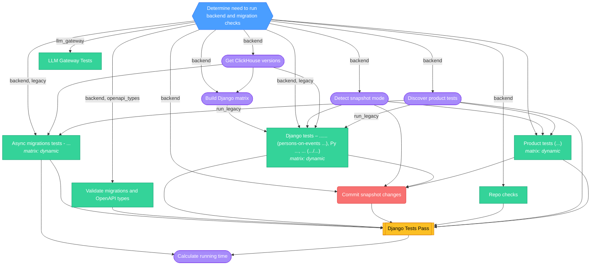
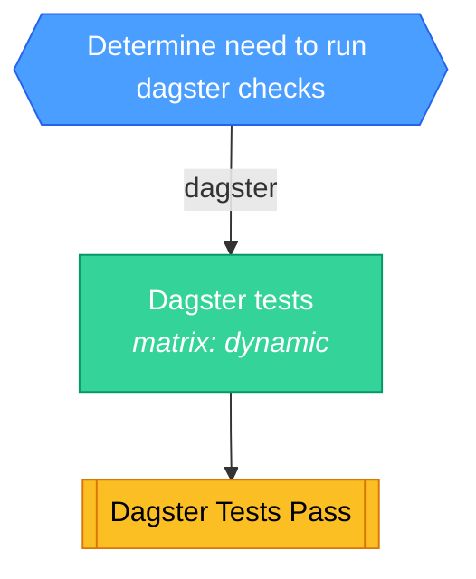
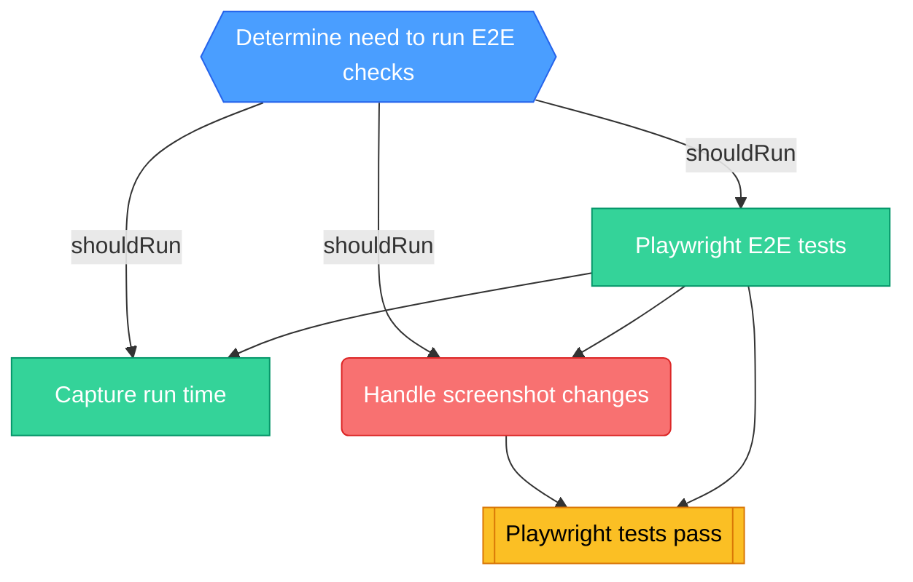
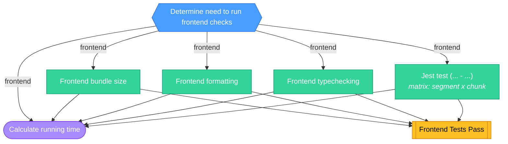
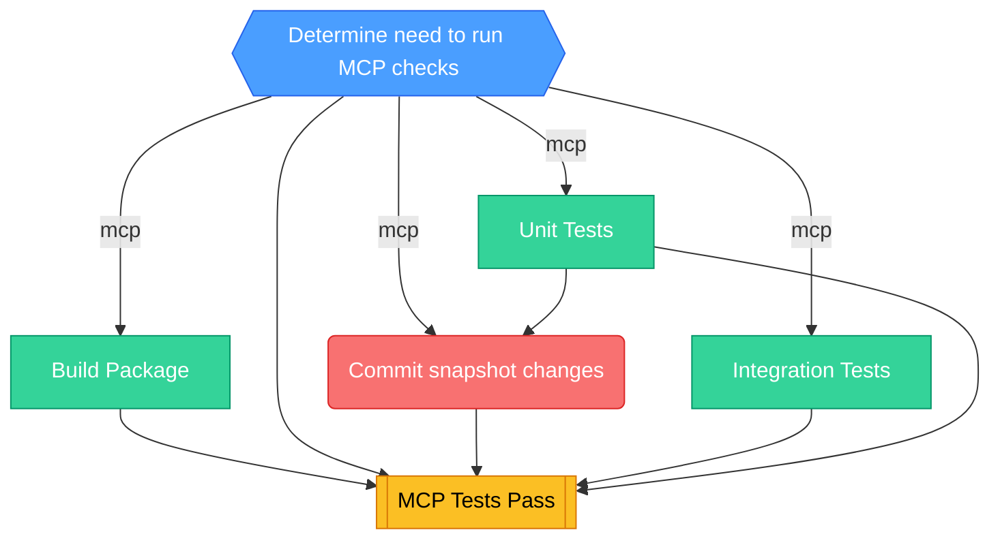
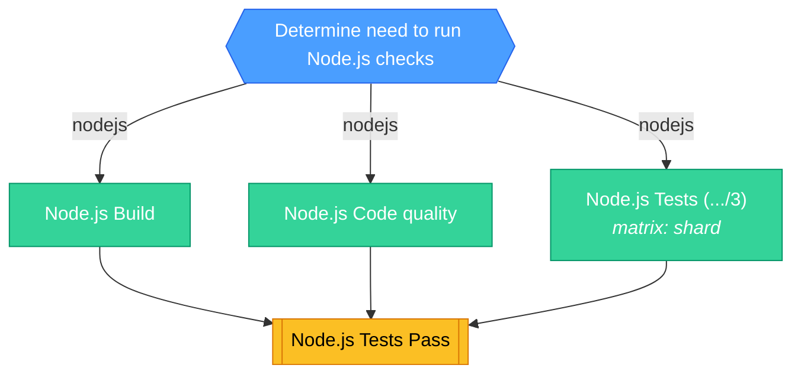
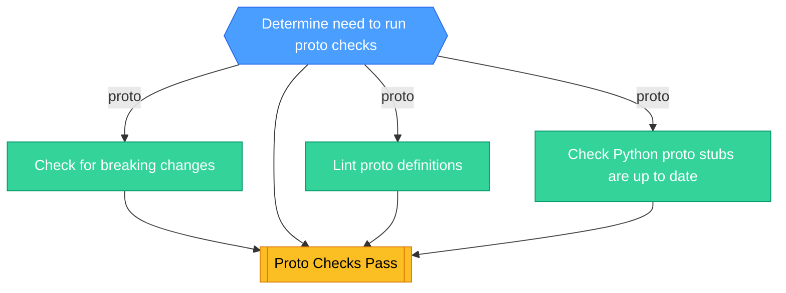
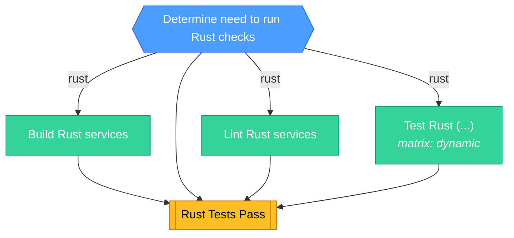
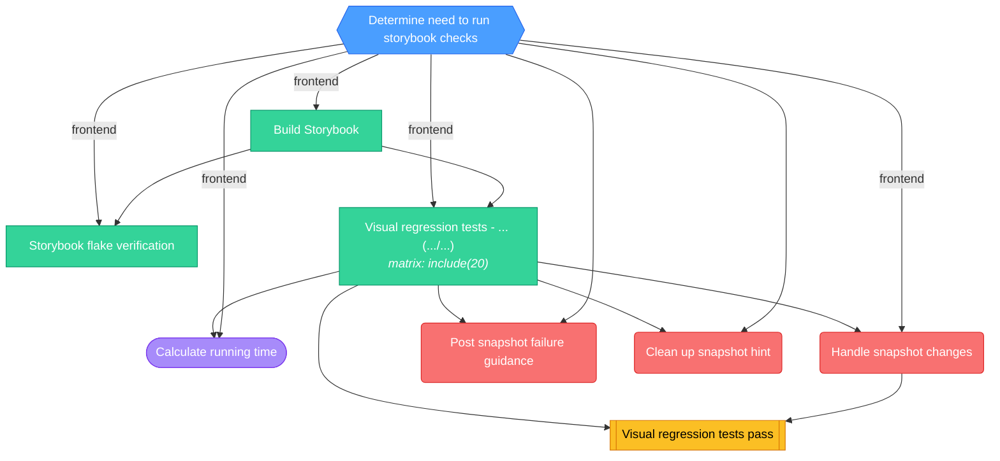

<!-- This file is auto-generated by bin/generate-ci-diagrams.py. Do not edit manually. -->

Visual DAG diagrams for PostHog's CI workflows.
Auto-generated from workflow YAML files by `bin/generate-ci-diagrams.py`.

### Legend

| Shape        | Color  | Meaning                   |
| ------------ | ------ | ------------------------- |
| Hexagon      | Blue   | Gate / change detection   |
| Stadium      | Purple | Plumbing / matrix builder |
| Rectangle    | Green  | Test / core work          |
| Subroutine   | Yellow | Collation / status gate   |
| Rounded rect | Red    | Side effect / snapshots   |

Edge labels show the change-detection output that gates the job.

## Backend CI (`ci-backend.yml`)

**Triggers**: `merge_group`, `pull_request`, `push`, `workflow_dispatch`

Job details

| Job                       | Depends on                                                                                             | Condition                                                                                                                                                                                                                                | Matrix  |
| ------------------------- | ------------------------------------------------------------------------------------------------------ | ---------------------------------------------------------------------------------------------------------------------------------------------------------------------------------------------------------------------------------------- | ------- |
| `changes`                 | -                                                                                                      | -                                                                                                                                                                                                                                        | -       |
| `check-migrations`        | changes                                                                                                | backend \|\| openapi_types                                                                                                                                                                                                               | -       |
| `detect-snapshot-mode`    | changes                                                                                                | backend                                                                                                                                                                                                                                  | -       |
| `get_clickhouse_versions` | changes                                                                                                | backend                                                                                                                                                                                                                                  | -       |
| `build_django_matrix`     | changes, get_clickhouse_versions                                                                       | backend                                                                                                                                                                                                                                  | -       |
| `llm-gateway`             | changes                                                                                                | llm_gateway                                                                                                                                                                                                                              | -       |
| `repo-checks`             | changes                                                                                                | backend                                                                                                                                                                                                                                  | -       |
| `turbo-discover`          | changes                                                                                                | backend                                                                                                                                                                                                                                  | -       |
| `async-migrations`        | changes, turbo-discover, get_clickhouse_versions                                                       | backend && (legacy \|\| run_legacy \|\| (needs.turbo-discover.result != 'success' && needs.turbo-discover.result != 'skipped'))                                                                                                          | dynamic |
| `django`                  | changes, turbo-discover, detect-snapshot-mode, get_clickhouse_versions, build_django_matrix            | backend && needs.build_django_matrix.result == 'success' && (legacy \|\| run_legacy \|\| (needs.turbo-discover.result != 'success' && needs.turbo-discover.result != 'skipped'))                                                         | dynamic |
| `turbo-tests`             | changes, turbo-discover, detect-snapshot-mode                                                          | needs.turbo-discover.result == 'success' && needs.turbo-discover.outputs.matrix != '[]' && needs.turbo-discover.outputs.matrix != ''                                                                                                     | dynamic |
| `handle-snapshots`        | changes, detect-snapshot-mode, django, turbo-tests                                                     | needs.detect-snapshot-mode.outputs.mode == 'update' && backend && github.event.pull_request.head.repo.full_name == 'PostHog/posthog'                                                                                                     | -       |
| `django_tests`            | django, check-migrations, async-migrations, turbo-discover, turbo-tests, handle-snapshots, repo-checks | -                                                                                                                                                                                                                                        | -       |
| `calculate-running-time`  | django_tests, async-migrations                                                                         | github.actor != 'dependabot[bot]' && ( (github.event_name == 'pull_request' && github.event.pull_request.head.repo.full_name == 'PostHog/posthog') \|\| (github.event_name != 'pull_request' && github.repository == 'PostHog/posthog')) | -       |

## Dagster CI (`ci-dagster.yml`)

**Triggers**: `pull_request`, `push`

Job details

| Job             | Depends on | Condition | Matrix  |
| --------------- | ---------- | --------- | ------- |
| `changes`       | -          | -         | -       |
| `dagster`       | changes    | dagster   | dynamic |
| `dagster_tests` | dagster    | -         | -       |

## E2E CI Playwright (`ci-e2e-playwright.yml`)

**Triggers**: `pull_request`, `push`, `workflow_dispatch`

Job details

| Job                  | Depends on                     | Condition                                                                                                                                                                                                                                             | Matrix |
| -------------------- | ------------------------------ | ----------------------------------------------------------------------------------------------------------------------------------------------------------------------------------------------------------------------------------------------------- | ------ |
| `changes`            | -                              | github.event_name == 'push' \|\| github.event.pull_request.head.repo.full_name == github.repository                                                                                                                                                   | -      |
| `playwright`         | changes                        | shouldRun                                                                                                                                                                                                                                             | -      |
| `capture-run-time`   | changes, playwright            | github.actor != 'dependabot[bot]' && shouldRun && ( (github.event_name == 'pull_request' && github.event.pull_request.head.repo.full_name == 'PostHog/posthog') \|\| (github.event_name != 'pull_request' && github.repository == 'PostHog/posthog')) | -      |
| `handle-screenshots` | playwright, changes            | needs.changes.outputs.mode == 'update' && shouldRun && github.event.pull_request.head.repo.full_name == github.repository                                                                                                                             | -      |
| `playwright_tests`   | playwright, handle-screenshots | -                                                                                                                                                                                                                                                     | -      |

## Frontend CI (`ci-frontend.yml`)

**Triggers**: `merge_group`, `pull_request`, `push`

Job details

| Job                          | Depends on                                                                       | Condition                                                                                                                                                                                                                                            | Matrix          |
| ---------------------------- | -------------------------------------------------------------------------------- | ---------------------------------------------------------------------------------------------------------------------------------------------------------------------------------------------------------------------------------------------------- | --------------- |
| `changes`                    | -                                                                                | -                                                                                                                                                                                                                                                    | -               |
| `frontend-bundle-size`       | changes                                                                          | frontend && github.event_name != 'merge_group'                                                                                                                                                                                                       | -               |
| `frontend-format`            | changes                                                                          | frontend                                                                                                                                                                                                                                             | -               |
| `frontend-typescript-checks` | changes                                                                          | frontend                                                                                                                                                                                                                                             | -               |
| `jest`                       | changes                                                                          | frontend                                                                                                                                                                                                                                             | segment x chunk |
| `calculate-running-time`     | jest, frontend-typescript-checks, frontend-format, frontend-bundle-size, changes | github.actor != 'dependabot[bot]' && frontend && ( (github.event_name == 'pull_request' && github.event.pull_request.head.repo.full_name == 'PostHog/posthog') \|\| (github.event_name != 'pull_request' && github.repository == 'PostHog/posthog')) | -               |
| `frontend_tests`             | jest, frontend-format, frontend-bundle-size, frontend-typescript-checks          | -                                                                                                                                                                                                                                                    | -               |

## MCP CI (`ci-mcp.yml`)

**Triggers**: `pull_request`, `push`

Job details

| Job                 | Depends on                                                      | Condition                                                                                                                                                                                                                          | Matrix |
| ------------------- | --------------------------------------------------------------- | ---------------------------------------------------------------------------------------------------------------------------------------------------------------------------------------------------------------------------------- | ------ |
| `changes`           | -                                                               | -                                                                                                                                                                                                                                  | -      |
| `build`             | changes                                                         | mcp                                                                                                                                                                                                                                | -      |
| `integration-tests` | changes                                                         | mcp                                                                                                                                                                                                                                | -      |
| `unit-tests`        | changes                                                         | mcp                                                                                                                                                                                                                                | -      |
| `handle-snapshots`  | changes, unit-tests                                             | mcp && github.event_name == 'pull_request' && github.event.pull_request.head.repo.full_name == github.repository && !contains(github.actor, '[bot]') && github.actor != 'posthog-bot' && !contains(github.actor, 'github-actions') | -      |
| `mcp_tests`         | changes, build, unit-tests, integration-tests, handle-snapshots | -                                                                                                                                                                                                                                  | -      |

## Node.js CI (`ci-nodejs.yml`)

**Triggers**: `merge_group`, `pull_request`, `push`

Job details

| Job          | Depends on         | Condition | Matrix |
| ------------ | ------------------ | --------- | ------ |
| `changes`    | -                  | -         | -      |
| `build`      | changes            | nodejs    | -      |
| `lint`       | changes            | nodejs    | -      |
| `tests`      | changes            | nodejs    | shard  |
| `node_tests` | tests, build, lint | -         | -      |

## Proto CI (`ci-proto.yml`)

**Triggers**: `merge_group`, `pull_request`, `push`, `workflow_dispatch`

Job details

| Job              | Depends on                              | Condition                              | Matrix |
| ---------------- | --------------------------------------- | -------------------------------------- | ------ |
| `changes`        | -                                       | github.repository == 'PostHog/posthog' | -      |
| `breaking`       | changes                                 | proto                                  | -      |
| `lint`           | changes                                 | proto                                  | -      |
| `python-codegen` | changes                                 | proto                                  | -      |
| `proto_checks`   | changes, lint, breaking, python-codegen | -                                      | -      |

## Rust CI (`ci-rust.yml`)

**Triggers**: `merge_group`, `pull_request`, `push`, `workflow_dispatch`

Job details

| Job          | Depends on                    | Condition                              | Matrix  |
| ------------ | ----------------------------- | -------------------------------------- | ------- |
| `changes`    | -                             | github.repository == 'PostHog/posthog' | -       |
| `build`      | changes                       | rust                                   | -       |
| `linting`    | changes                       | rust                                   | -       |
| `test`       | changes                       | rust                                   | dynamic |
| `rust_tests` | changes, build, test, linting | -                                      | -       |

## Security (`ci-security.yaml`)

**Triggers**: `merge_group`, `pull_request`, `push`

Job details

```mermaid
graph TD
    classDef gate fill:#4a9eff,stroke:#2563eb,color:#fff
    classDef plumbing fill:#a78bfa,stroke:#7c3aed,color:#fff
    classDef test fill:#34d399,stroke:#059669,color:#fff
    classDef collation fill:#fbbf24,stroke:#d97706,color:#000
    classDef sideeffect fill:#f87171,stroke:#dc2626,color:#fff

    ensure-pinned-actions["ensure-pinned-actions"]
    semgrep-general["semgrep-general"]
    semgrep-go["semgrep-go"]
    semgrep-js["semgrep-js"]
    semgrep-python["semgrep-python"]
    semgrep-rust["semgrep-rust"]
    semgrep-test-rules["semgrep-test-rules"]
    semgrep_checks[["Semgrep Checks Pass"]]

    semgrep-general --> semgrep_checks
    semgrep-go --> semgrep_checks
    semgrep-js --> semgrep_checks
    semgrep-python --> semgrep_checks
    semgrep-rust --> semgrep_checks
    semgrep-test-rules --> semgrep_checks

    class ensure-pinned-actions test
    class semgrep-general test
    class semgrep-go test
    class semgrep-js test
    class semgrep-python test
    class semgrep-rust test
    class semgrep-test-rules test
    class semgrep_checks collation
```

| Job                     | Depends on                                                                                | Condition | Matrix |
| ----------------------- | ----------------------------------------------------------------------------------------- | --------- | ------ |
| `ensure-pinned-actions` | -                                                                                         | -         | -      |
| `semgrep-general`       | -                                                                                         | -         | -      |
| `semgrep-go`            | -                                                                                         | -         | -      |
| `semgrep-js`            | -                                                                                         | -         | -      |
| `semgrep-python`        | -                                                                                         | -         | -      |
| `semgrep-rust`          | -                                                                                         | -         | -      |
| `semgrep-test-rules`    | -                                                                                         | -         | -      |
| `semgrep_checks`        | semgrep-python, semgrep-go, semgrep-rust, semgrep-js, semgrep-general, semgrep-test-rules | -         | -      |

## Storybook (`ci-storybook.yml`)

**Triggers**: `merge_group`, `pull_request`, `push`

Job details

| Job                        | Depends on                          | Condition                                                                                                                                                                                                                                            | Matrix      |
| -------------------------- | ----------------------------------- | ---------------------------------------------------------------------------------------------------------------------------------------------------------------------------------------------------------------------------------------------------- | ----------- |
| `changes`                  | -                                   | github.event_name != 'merge_group'                                                                                                                                                                                                                   | -           |
| `build-storybook`          | changes                             | frontend                                                                                                                                                                                                                                             | -           |
| `flake-verification`       | changes, build-storybook            | frontend && github.event_name == 'pull_request'                                                                                                                                                                                                      | -           |
| `visual-regression`        | changes, build-storybook            | frontend                                                                                                                                                                                                                                             | include(20) |
| `calculate-running-time`   | visual-regression, changes          | github.actor != 'dependabot[bot]' && frontend && ( (github.event_name == 'pull_request' && github.event.pull_request.head.repo.full_name == 'PostHog/posthog') \|\| (github.event_name != 'pull_request' && github.repository == 'PostHog/posthog')) | -           |
| `handle-snapshots`         | visual-regression, changes          | needs.changes.outputs.mode == 'update' && frontend && github.event.pull_request.head.repo.full_name == github.repository                                                                                                                             | -           |
| `snapshot-failure-comment` | visual-regression, changes          | needs.visual-regression.result == 'failure' && needs.changes.outputs.mode == 'check' && github.event_name == 'pull_request' && github.event.pull_request.head.repo.full_name == github.repository                                                    | -           |
| `snapshot-success-cleanup` | visual-regression, changes          | needs.visual-regression.result == 'success' && github.event_name == 'pull_request' && github.event.pull_request.head.repo.full_name == github.repository                                                                                             | -           |
| `visual_regression_tests`  | visual-regression, handle-snapshots | -                                                                                                                                                                                                                                                    | -           |

