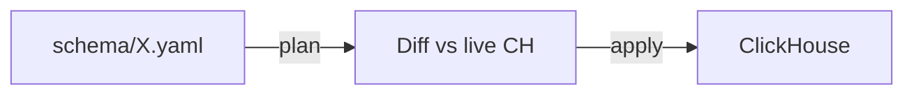

# ClickHouse migrations

This directory contains ClickHouse schema migrations for PostHog.

## How it works

The old migration system (`run_sql_with_exceptions`) asks you to pick from 12 node roles,
know whether a table is sharded, remember to set `is_alter_on_replicated_table`,
and get the execution order right for companion tables (Kafka, MV, Distributed).
Miss any of these and your migration runs on the wrong nodes, silently.

The new system works like Terraform for ClickHouse.
You declare the schema you want in YAML, diff it against what's actually running, and apply the difference.

```bash
# Scaffold a new table ecosystem
python manage.py ch_migrate generate --template ingestion_pipeline --table sessions_v4

# See what would change
python manage.py ch_migrate plan

# Do it
python manage.py ch_migrate apply
```



The plan output shows every SQL statement, which hosts it targets, and the execution order.
Review it the same way you'd review a Terraform plan before hitting apply.

## Migration approaches

### Desired-state YAML (new)

Schema is declared in `posthog/clickhouse/schema/*.yaml`.
The system diffs desired state against live ClickHouse and generates a plan.

Developer flow:

```bash
# Generate a schema YAML from a template
python manage.py ch_migrate generate --template ingestion_pipeline --table sessions_v4

# Diff desired vs current, show plan
python manage.py ch_migrate plan

# Execute the plan
python manage.py ch_migrate apply
```

### Legacy .py migrations

The numbered `.py` files (0001 through 0223) are legacy migrations
managed by `migrate_clickhouse`.
They are untouched and still discoverable by `ch_migrate check`.

## Schema YAML format

Each YAML file declares one table ecosystem:

```yaml
ecosystem: events
cluster: main

tables:
  sharded_events:
    engine: ReplicatedReplacingMergeTree
    sharded: true
    on_nodes: DATA
    order_by: [team_id, 'toDate(timestamp)', event]
    partition_by: 'toYYYYMM(timestamp)'
    columns:
      - name: uuid
        type: UUID
      - name: event
        type: String

  writable_events:
    engine: Distributed
    source: sharded_events
    on_nodes: COORDINATOR
    columns: inherit sharded_events

  events:
    engine: Distributed
    source: sharded_events
    on_nodes: ALL
    columns: inherit sharded_events
```

## `ch_migrate` subcommands

| Command     | Description                              |
| ----------- | ---------------------------------------- |
| `plan`      | Diff schema YAML vs live ClickHouse      |
| `apply`     | Execute the reconciliation plan          |
| `generate`  | Scaffold a schema YAML from a template   |
| `drift`     | Detect per-host schema divergence        |
| `schema`    | Dump current live schema                 |
| `status`    | Show per-host migration tracking records |
| `bootstrap` | Create the tracking table                |
| `check`     | Show pending legacy migrations           |
| `lint`      | Validate schema YAML files               |
| `down`      | Roll back a legacy migration by number   |

## Schema safety

The diff engine respects ClickHouse ecosystem rules:

- DROP MV before altering source tables
- CREATE local tables before Distributed tables
- CREATE Kafka tables before MVs
- ALTER all ecosystem tables when adding a column

The `lint` command checks for ecosystem completeness
and cross-cluster targeting mismatches.

## Node roles

| Role             | Meaning                                         |
| ---------------- | ----------------------------------------------- |
| DATA             | Data storage nodes (sharded local tables)       |
| COORDINATOR      | Coordinator nodes (writable distributed tables) |
| ALL              | All nodes in the cluster                        |
| INGESTION_EVENTS | Events ingestion nodes (Kafka tables, MVs)      |
| INGESTION_SMALL  | Small ingestion pipeline nodes                  |
| INGESTION_MEDIUM | Medium ingestion pipeline nodes                 |
| SHUFFLEHOG       | Shufflehog nodes                                |
| ENDPOINTS        | Endpoint nodes                                  |
| LOGS             | Log nodes                                       |

## FAQ

**What happens to live writes during ALTER TABLE on sharded_events?**

Nothing. `ALTER ADD COLUMN` on ReplicatedMergeTree is metadata-only -- it completes in milliseconds regardless of table size.
Writes keep going. Same behavior as the old system.

**What about ALTER MODIFY COLUMN (type changes)?**

That rewrites data parts and can take hours on large tables.
The plan flags it with a warning. Schedule these carefully and coordinate with whoever's on-call.

**What happens during the MV drop/recreate gap?**

There's a sub-second window where Kafka messages aren't consumed by that MV.
Kafka retains them, and the new MV picks up from the last committed offset.
Same window the old system had.

**What if a shard fails during apply?**

Apply halts immediately. The tracking table records which steps succeeded on which hosts.
Re-running is safe -- all generated SQL uses `IF NOT EXISTS` / `IF EXISTS`.

**How do the 231 legacy migrations coexist?**

They're untouched. `migrate_clickhouse` still runs them in order.
The two systems coexist. `run_sql_with_exceptions` has a deprecation warning pointing here.

**What about drift between hosts?**

`ch_migrate drift` queries `system.tables` on every host and compares.
Use `--halt-on-drift` on apply to block execution if hosts disagree.

**How do I roll back?**

Edit the schema YAML (revert your change), run `plan`, run `apply`.
Git history of the YAML files is your rollback mechanism.
