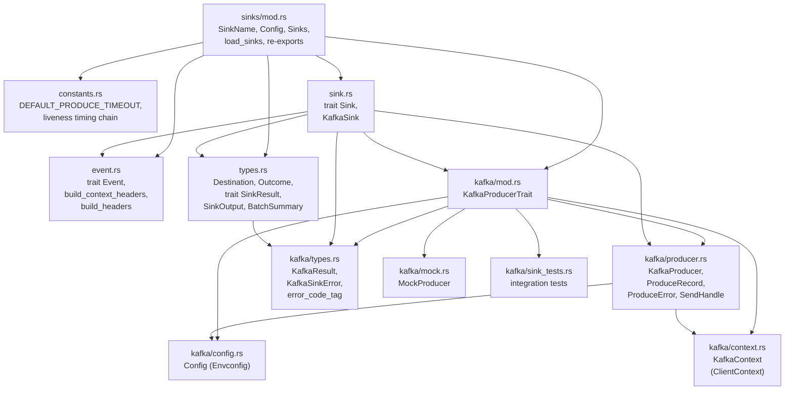
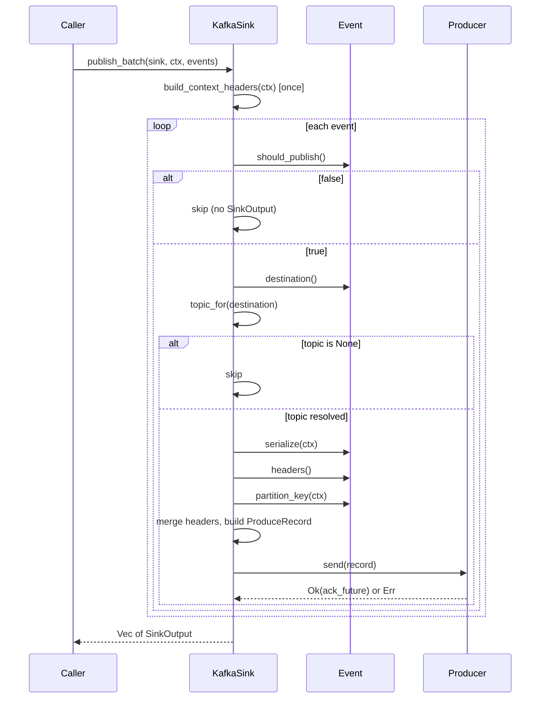
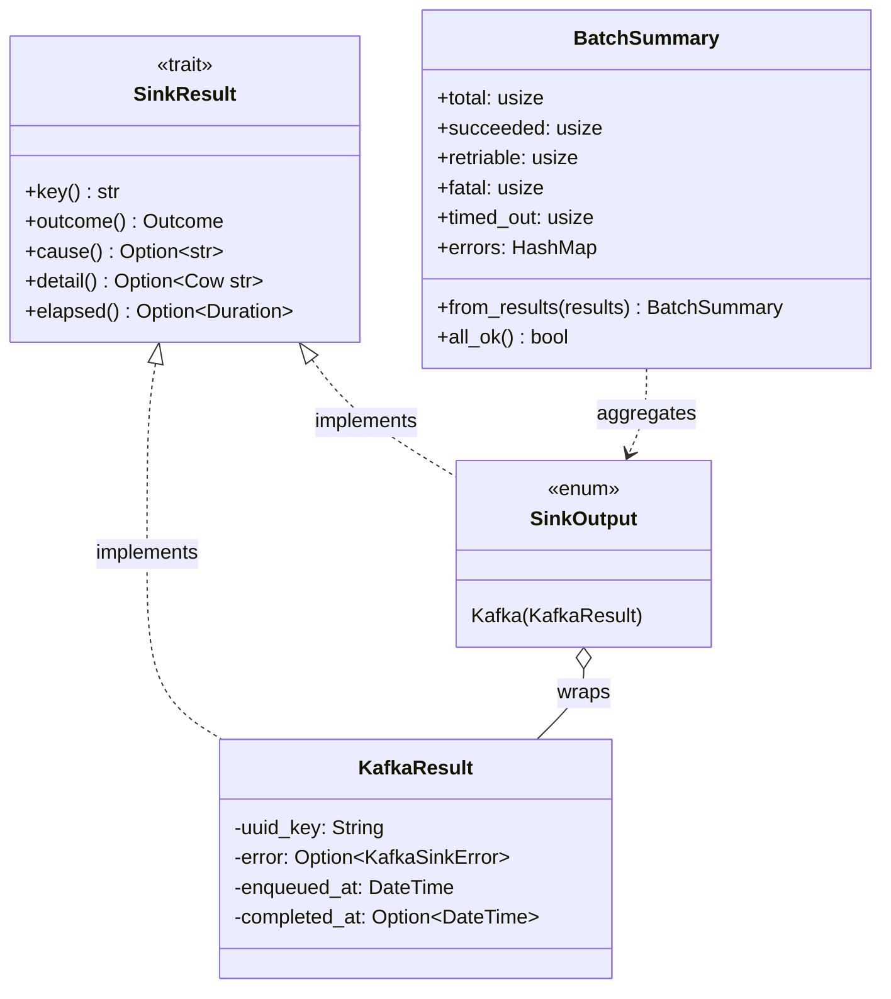
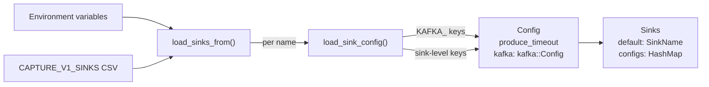
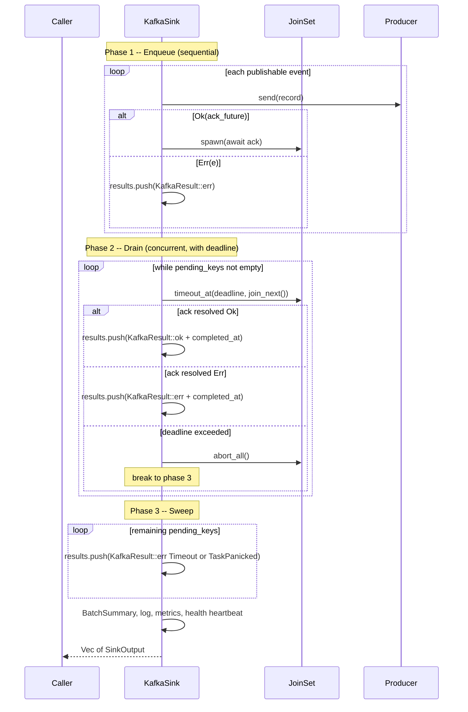

# v1/sinks design

This document covers the architecture and key design choices in the
`v1::sinks` module -- the destination-agnostic event publishing layer
for PostHog capture.

## Module layout



---

## 1. Sink abstraction

`trait Sink` (in `sink.rs`) is the backend-agnostic publishing interface:

```rust
#[async_trait]
pub trait Sink: Send + Sync {
    async fn publish(&self, sink: SinkName, ctx: &Context, event: &(dyn Event + Send + Sync)) -> Option<SinkOutput>;
    async fn publish_batch(&self, sink: SinkName, ctx: &Context, events: &[&(dyn Event + Send + Sync)]) -> Vec<SinkOutput>;
    fn sinks(&self) -> Vec<SinkName>;
    fn flush(&self) -> anyhow::Result<()>;
}
```

Key points:

- **Returns `SinkOutput`, not `Box<dyn SinkResult>`.**
  The return type is a concrete enum, not a trait object.
  See [section 3](#3-sinkoutput-enum-dispatch) for why.
- `publish` delegates to `publish_batch` with a single-element slice.
- `sinks()` exposes which named producers are available.
- `flush()` drains in-flight messages for graceful shutdown.

`KafkaSink<P: KafkaProducerTrait>` is the first (and currently only) implementation.
It is generic over the producer trait so tests can inject `MockProducer`
without touching real Kafka.

Adding a future backend (S3, HTTP, etc.) means:

1. Add a variant to `SinkOutput` (e.g. `S3(S3Result)`)
2. Implement `SinkResult` on the new result type
3. Write a new struct implementing `Sink`

---

## 2. Event abstraction

`trait Event` (in `event.rs`) decouples the sink from any specific
capture endpoint, `CaptureMode`, or event schema:

```rust
pub trait Event: Send + Sync {
    fn uuid_key(&self) -> &str;
    fn should_publish(&self) -> bool;
    fn destination(&self) -> &Destination;
    fn headers(&self) -> Vec<(String, String)>;
    fn partition_key(&self, ctx: &Context) -> String;
    fn serialize(&self, ctx: &Context) -> Result<String, String>;
}
```

### Skip mechanisms

Callers have two orthogonal ways to prevent an event from being produced:

| Mechanism | Where set | Effect |
|---|---|---|
| `should_publish() == false` | Pipeline validation (e.g. `EventResult != Ok`) | Event silently skipped, no `SinkOutput` returned |
| `Destination::Drop` | Routing logic (e.g. quota limiter) | `topic_for()` returns `None`, event skipped |

### Header merging

Headers are built in two layers to avoid redundant work per event:

1. **Batch-level** -- `build_context_headers(ctx)` produces `token`, `now`,
   and optionally `historical_migration`. Called once per batch.
2. **Event-level** -- `event.headers()` returns per-event metadata.
   `build_headers` merges them. The sink converts the final
   `Vec<(String, String)>` to transport-specific format (e.g. Kafka
   `OwnedHeaders`).

### Publish sequence



---

## 3. SinkOutput enum dispatch

### The SinkResult trait

`trait SinkResult` (in `types.rs`) defines a backend-agnostic interface for
inspecting per-event publish outcomes:

```rust
pub trait SinkResult: Send + Sync {
    fn key(&self) -> &str;              // event UUID -- correlation key
    fn outcome(&self) -> Outcome;       // Success | Timeout | RetriableError | FatalError
    fn cause(&self) -> Option<&'static str>;  // low-cardinality metric tag
    fn detail(&self) -> Option<Cow<'_, str>>; // human-readable error detail
    fn elapsed(&self) -> Option<chrono::Duration>; // enqueue-to-ack latency
}
```

### The concrete enum

```rust
pub enum SinkOutput {
    Kafka(KafkaResult),
    // future: S3(S3Result), Http(HttpResult), ...
}

impl SinkResult for SinkOutput {
    fn key(&self) -> &str {
        match self { Self::Kafka(r) => r.key() }
    }
    // ... delegates every method to the inner type
}
```

### Why not `Box<dyn SinkResult>`

At 100K+ events/sec, allocating a `Box` per event for trait-object dispatch
is measurable overhead. The enum approach gives us:

- **Stack allocation** -- no per-event heap alloc
- **Monomorphic dispatch** -- compiler can inline through the `match`
- **Branch prediction** -- single-variant enum is effectively zero-cost

### The intentional abstraction leak

The abstract `Sink` layer has direct knowledge of Kafka internals:

- `sinks/mod.rs` re-exports `KafkaResult` and `KafkaSinkError`
- `sink.rs` imports `KafkaProducerTrait`, `ProduceRecord`, `KafkaResult`

This is a deliberate trade-off. The alternative -- a fully abstract
`Sink` that never mentions Kafka -- would require either:

- `Box<dyn SinkResult>` (per-event heap allocation), or
- A complex generic type parameter threaded through every call site

The practical cost of the leak is low: adding a second backend means adding
one `SinkOutput` variant and one `match` arm per `SinkResult` method.
That is trivial maintenance compared to the allocation overhead of full
abstraction.

### BatchSummary

`BatchSummary::from_results(&[SinkOutput])` aggregates outcomes uniformly
regardless of which variant produced them:

```rust
pub struct BatchSummary {
    pub total: usize,
    pub succeeded: usize,
    pub retriable: usize,
    pub fatal: usize,
    pub timed_out: usize,
    pub errors: HashMap<String, usize>,  // cause tag -> count
}
```

Used for log-level selection, error counters, and health heartbeat decisions.



---

## 4. Configuration and multi-producer extensibility

### Env var layout

Each sink is identified by a `SinkName` enum variant (`Msk`, `MskAlt`, `Ws`).
Active sinks are declared via a single CSV env var:

```bash
CAPTURE_V1_SINKS=msk,ws
```

Each sink's config lives under a namespaced prefix derived from its name:

```bash
CAPTURE_V1_SINK_MSK_PRODUCE_TIMEOUT_MS=30000
CAPTURE_V1_SINK_MSK_KAFKA_HOSTS=broker1:9092,broker2:9092
CAPTURE_V1_SINK_MSK_KAFKA_TOPIC_MAIN=events_main
CAPTURE_V1_SINK_MSK_KAFKA_LINGER_MS=20
...
```

### Two-pass key split

`load_sink_config` splits env keys under the sink prefix into two maps:

| Sub-prefix | Destination | Example key |
|---|---|---|
| `KAFKA_*` | `kafka::config::Config` (Envconfig) | `KAFKA_HOSTS` -> field `hosts` |
| everything else | Sink-level config | `PRODUCE_TIMEOUT_MS` -> `produce_timeout` |

This makes the transport-specific config cleanly composable: a future S3
sink would use an `S3_` sub-prefix alongside `PRODUCE_TIMEOUT_MS`.

### Config structs



- `Config { produce_timeout, kafka }` -- transport-agnostic timeout
  alongside transport-specific config.
- `Sinks { default, configs }` -- first CSV entry becomes the default
  sink for single-write mode. `configs` is a `HashMap<SinkName, Config>`
  for multi-producer lookup.

### Validation

`Config::validate()` enforces:

- `produce_timeout >= message_timeout_ms` -- prevents ghost deliveries
  where librdkafka delivers a message after the application has already
  timed out and reported failure.
- Non-empty `kafka.hosts`.

`Sinks::validate()` ensures at least one sink is configured and delegates
to each `Config::validate()`.

### Multi-producer extensibility

The `SinkName` enum + `HashMap<SinkName, Config>` pattern supports
concurrent dual-writes to multiple Kafka clusters (e.g. MSK + WarpStream
during a migration). Each sink gets its own `KafkaProducer`, independent
config, and independent health tracking. The caller selects which sink(s)
to write to per batch.

---

## 5. Producer health monitoring

### Health primitive

`lifecycle::Handle` provides a heartbeat-based health model:

- `report_healthy()` -- resets the liveness timer
- `is_healthy()` -- returns `true` if a heartbeat arrived within the
  liveness deadline

There is no explicit `report_unhealthy()`. Unhealthy state is inferred from
**missed heartbeats** -- if no source calls `report_healthy()` within
`SINK_LIVENESS_DEADLINE` (30s), the handle is considered stalled.

### Heartbeat sources

Three independent sources feed the same `Handle`:

| Source | When | Location |
|---|---|---|
| `KafkaProducer::new` | Initial metadata fetch succeeds | `producer.rs` |
| `KafkaContext::stats` | Any broker reports state `"UP"` | `context.rs` |
| `KafkaSink::publish_batch` | At least one event in the batch succeeded | `sink.rs` |

### Timing chain

From `constants.rs`, the worst-case detection sequence:

```mermaid
gantt
    title Health detection timing (worst case)
    dateFormat X
    axisFormat %Ls

    section Heartbeat
    Last healthy heartbeat           :milestone, 0, 0

    section publish_batch
    Batch runs (produce_timeout 30s) :active, 0, 30

    section stats callback
    Stats fires (10s interval)       :crit, 10, 20
    Stats fires again                :crit, 20, 30

    section Detection
    Liveness deadline expires (30s)  :milestone, 30, 30
    Health poll detects stall        :milestone, 32, 32
```



1. Last successful heartbeat at t=0
2. `publish_batch` runs up to `produce_timeout` (30s), returns with 0
   successes -- no heartbeat
3. Stats callback fires every `statistics_interval_ms` (10s) but all
   brokers are down -- no heartbeat
4. At t=30s `SINK_LIVENESS_DEADLINE` expires
5. Next health poll (within 2s) detects `stall_count >= SINK_STALL_THRESHOLD` (1)
6. Global shutdown triggered at ~t=32s

### Health gate

At the top of `publish_batch`, if `!producer.is_ready()` the entire batch
is rejected with `KafkaSinkError::SinkUnavailable` (retriable). This
prevents queueing work against a producer that cannot reach its brokers.

---

## 6. Observability

### Metrics

Metrics are organized into three tiers:

#### Client-level (KafkaContext)

Emitted from the librdkafka stats callback and error callback. These
reflect the health of the underlying Kafka client independent of any
request.

| Metric | Type | Labels | Source |
|---|---|---|---|
| `capture_v1_kafka_client_errors_total` | counter | `cluster`, `mode`, `error` | `error()` callback, all-brokers-down in `stats()` |
| `capture_v1_kafka_producer_queue_depth` | gauge | `cluster`, `mode` | `stats()` |
| `capture_v1_kafka_producer_queue_bytes` | gauge | `cluster`, `mode` | `stats()` |
| `capture_v1_kafka_batch_size_bytes_avg` | gauge | `cluster`, `mode`, `topic` | `stats()` |
| `capture_v1_kafka_broker_connected` | gauge | `cluster`, `mode`, `broker` | `stats()` |
| `capture_v1_kafka_broker_rtt_us` | gauge | `cluster`, `mode`, `quantile`, `broker` | `stats()` |
| `capture_v1_kafka_broker_tx_errors_total` | counter | `cluster`, `mode`, `broker` | `stats()` via `.absolute()` |
| `capture_v1_kafka_broker_rx_errors_total` | counter | `cluster`, `mode`, `broker` | `stats()` via `.absolute()` |

Note: broker tx/rx error counters use `.absolute()` because librdkafka
reports cumulative values; the metrics library handles delta computation.

#### Request-path (KafkaSink::publish_batch)

Emitted per event or per batch during the publish flow. These carry
request-level context (`path`, `attempt`).

| Metric | Type | Labels | When |
|---|---|---|---|
| `capture_v1_kafka_publish_total` | counter | `mode`, `cluster`, `outcome`, `path`, `attempt` | Every event outcome (success, error, timeout, reject) |
| `capture_v1_kafka_ack_duration_seconds` | histogram | `mode`, `cluster`, `outcome`, `path`, `attempt` | Successful ack only |
| `capture_v1_kafka_produce_errors_total` | counter | `cluster`, `mode`, `error` | Post-batch, one increment per distinct error tag |

#### Error tagging

All error-related metrics use stable, low-cardinality tags derived from
`error_code_tag()` (maps `RDKafkaErrorCode` variants to snake_case strings)
and `KafkaSinkError::as_tag()` / `ProduceError::as_tag()`.

### Structured logging

| Level | When | Location |
|---|---|---|
| `info_span!("v1_publish_batch", ...)` | Wraps entire batch | `sink.rs` |
| `debug!` | All events succeeded | `sink.rs` |
| `ctx_log!(WARN)` | Partial batch failure | `sink.rs` |
| `ctx_log!(ERROR)` | Full batch failure | `sink.rs` |
| `error!` | Sink not configured, producer not ready | `sink.rs` |
| `error!` | rdkafka client error callback | `context.rs` |
| `error!` | All brokers down | `context.rs` |
| `info!` | Producer connected | `producer.rs` |
| `error!` | Initial metadata fetch failed | `producer.rs` |

---

## 7. Per-event result collection

`publish_batch` collects results in three phases, returning a `Vec<SinkOutput>`
where each entry corresponds 1:1 to a published event. Skipped events
(`should_publish() == false` or `Destination::Drop`) produce no entry.

### Three-phase pipeline



**Phase 1 -- Enqueue.** Events are sent sequentially to preserve
per-partition ordering. Each successful `send()` returns an ack future
that is spawned into a `JoinSet`. Immediate send errors (e.g. queue full)
produce a `KafkaResult::err` directly.

**Phase 2 -- Drain.** The `JoinSet` is drained under a per-sink
`produce_timeout` deadline. Each resolved future yields either a success
or an ack-level error, both stamped with `completed_at` for latency
measurement.

**Phase 3 -- Sweep.** Any keys still in `pending_keys` after the deadline
(or a task panic) are recorded as `Timeout` or `TaskPanicked`.

### HTTP response building

The caller correlates results back to original events using
`SinkResult::key()` (the event UUID). The `SinkResult` trait provides
everything needed to build per-event status in a batch HTTP response:

| Method | HTTP response use |
|---|---|
| `key()` | Match result to request event by UUID |
| `outcome()` | Map to HTTP status (Success -> 200-level, Retriable -> 503, Fatal -> 400-level) |
| `cause()` | Optional error code in response body |
| `detail()` | Optional human-readable error message |
| `elapsed()` | Optional latency metadata |

This design keeps the HTTP layer fully sink-agnostic: it consumes
`Vec<SinkOutput>` through the `SinkResult` trait without knowing whether
events went to Kafka, S3, or any future backend.
