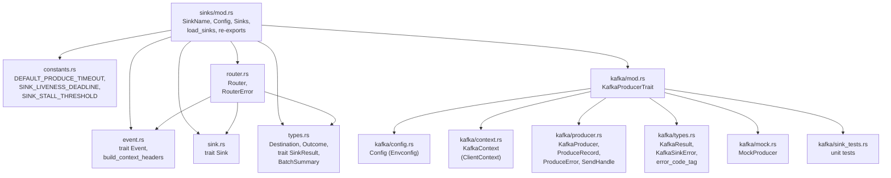
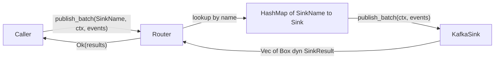
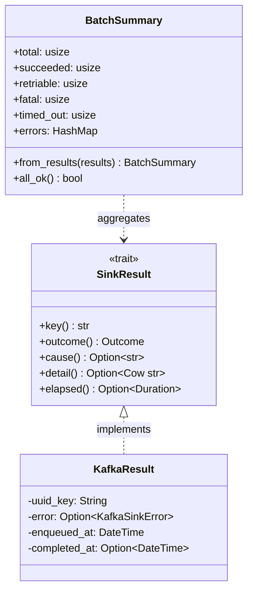
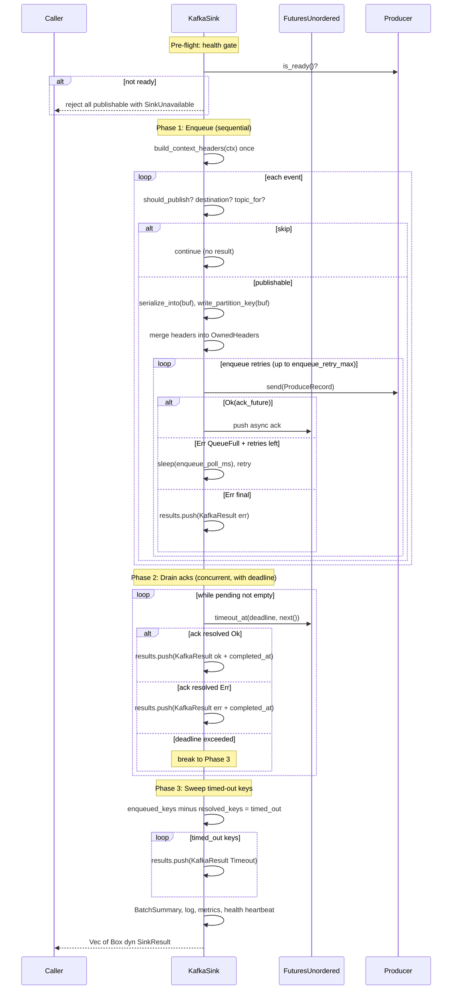
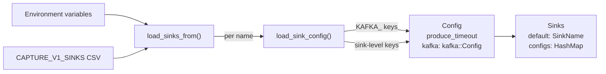

# v1/sinks design

Architecture and design choices in the `v1::sinks` module --
the destination-agnostic event publishing layer for PostHog capture.

## Module layout



The module has two layers:

- **Top-level abstractions** (`sink.rs`, `event.rs`, `types.rs`, `router.rs`)
  define backend-agnostic traits and routing.
  They know nothing about Kafka.
- **`kafka/`** implements those traits against rdkafka.
  All Kafka-specific logic is contained here.

`mod.rs` re-exports the public API:

```rust
pub use event::Event;
pub use kafka::KafkaSink;
pub use router::{Router, RouterError};
pub use sink::Sink;
pub use types::{Destination, Outcome, SinkResult};
```

---

## 1. Sink trait and Router

### Sink

`trait Sink` (`sink.rs`) is the backend-agnostic publishing interface:

```rust
#[async_trait]
pub trait Sink: Send + Sync {
    fn name(&self) -> SinkName;

    async fn publish_batch(
        &self,
        ctx: &Context,
        events: &[&(dyn Event + Send + Sync)],
    ) -> Vec<Box<dyn SinkResult>>;

    async fn flush(&self) -> anyhow::Result<()>;
}
```

Each `Sink` owns its identity (`name`), accepts a batch of trait-object
events, and returns one `Box<dyn SinkResult>` per published event.
Skipped events produce no result entry.

`KafkaSink<P: KafkaProducerTrait>` is currently the only implementation.
It is generic over the producer trait so tests inject `MockProducer`
without touching real Kafka.

### Router

`Router` (`router.rs`) owns the mapping from `SinkName` to concrete
`Box<dyn Sink>` instances and provides the caller-facing publish API:

```rust
pub struct Router {
    default: SinkName,
    sinks: HashMap<SinkName, Box<dyn Sink>>,
}
```

| Method | Purpose |
|---|---|
| `publish_batch(sink, ctx, events)` | Look up sink by name, delegate to `Sink::publish_batch` |
| `publish(sink, ctx, event)` | Convenience wrapper for single events |
| `default_sink()` | Returns the first sink from the `CAPTURE_V1_SINKS` CSV |
| `available_sinks()` | Lists all configured sink names |
| `flush()` | Flushes all sinks concurrently via `FuturesUnordered` |

The `Sink` trait intentionally takes no `SinkName` parameter -- the
Router resolves the target before calling into the sink. This keeps
`Sink` implementations stateless with respect to routing and makes the
single-sink case zero-cost.

`RouterError::SinkNotFound` is returned when a caller requests a sink
name that was not configured. This is a caller bug, not a per-event error.



---

## 2. Event abstraction

`trait Event` (`event.rs`) decouples the sink from any specific capture
endpoint, `CaptureMode`, or event schema:

```rust
pub trait Event: Send + Sync {
    fn uuid_key(&self) -> &str;
    fn should_publish(&self) -> bool;
    fn destination(&self) -> &Destination;
    fn headers(&self) -> Vec<(String, String)>;
    fn write_partition_key(&self, ctx: &Context, buf: &mut String);
    fn serialize_into(&self, ctx: &Context, buf: &mut String) -> Result<(), String>;
}
```

### Buffer-reuse pattern

`write_partition_key` and `serialize_into` write into caller-owned
`String` buffers that are cleared between events. This eliminates
per-event allocations after the first iteration -- the buffers grow to
high-water mark and stay there for the entire batch.

### Skip mechanisms

Callers have two orthogonal ways to prevent an event from being produced:

| Mechanism | Where set | Effect |
|---|---|---|
| `should_publish() == false` | Pipeline validation (e.g. `EventResult != Ok`) | Silently skipped, no `SinkResult` returned |
| `Destination::Drop` | Routing logic (e.g. quota limiter) | `topic_for()` returns `None`, event skipped |

### Header layering

Headers are built in two layers to avoid redundant work per event:

1. **Batch-level** -- `build_context_headers(ctx)` produces `token`, `now`,
   and optionally `historical_migration`. Called once per batch.
2. **Event-level** -- `event.headers()` returns per-event metadata.

The sink merges both into transport-specific format (e.g. Kafka
`OwnedHeaders`) inline during the enqueue phase. There is no separate
merge function.

---

## 3. SinkResult and outcome model

### The SinkResult trait

`trait SinkResult` (`types.rs`) defines a backend-agnostic interface for
inspecting per-event publish outcomes:

```rust
pub trait SinkResult: Send + Sync {
    fn key(&self) -> &str;              // event UUID -- correlation key
    fn outcome(&self) -> Outcome;       // Success | Timeout | RetriableError | FatalError
    fn cause(&self) -> Option<&'static str>;  // low-cardinality metric tag
    fn detail(&self) -> Option<Cow<'_, str>>; // human-readable error detail
    fn elapsed(&self) -> Option<chrono::Duration>; // enqueue-to-ack latency
}
```

`publish_batch` returns `Vec<Box<dyn SinkResult>>` -- one entry per
published event. The trait-object approach keeps the `Sink` trait fully
backend-agnostic: callers never need to know which backend produced a
result. The per-event heap allocation is a deliberate trade-off for
simplicity; at current batch sizes the cost is negligible compared to
Kafka I/O.

### Outcome

```rust
pub enum Outcome {
    InFlight,       // pre-resolution default
    Success,
    Timeout,
    RetriableError,
    FatalError,
}
```

### KafkaResult

`KafkaResult` (`kafka/types.rs`) is the Kafka-specific implementation:

```rust
pub struct KafkaResult {
    uuid_key: String,
    error: Option<KafkaSinkError>,
    enqueued_at: DateTime<Utc>,
    completed_at: Option<DateTime<Utc>>,
}
```

Outcome is derived from the error -- `None` means `Success`, otherwise
`KafkaSinkError::outcome()` maps to the appropriate `Outcome` variant.

### KafkaSinkError

Captures every failure mode within a single configured sink:

| Variant | Outcome | When |
|---|---|---|
| `SinkUnavailable` | `RetriableError` | Producer health gate failed |
| `SerializationFailed(String)` | `FatalError` | `serialize_into` returned `Err` |
| `Produce(ProduceError)` | Depends on `ProduceError::is_retriable()` | rdkafka send or delivery error |
| `Timeout` | `Timeout` | Ack not received within `produce_timeout` |
| `TaskPanicked` | `RetriableError` | Ack task panicked (should not happen with `FuturesUnordered`) |

### BatchSummary

`BatchSummary::from_results` aggregates a `&[Box<dyn SinkResult>]` into
counts used for log-level selection, error counters, and health heartbeat
decisions:

```rust
pub struct BatchSummary {
    pub total: usize,
    pub succeeded: usize,
    pub retriable: usize,
    pub fatal: usize,
    pub timed_out: usize,
    pub errors: HashMap<String, usize>,  // cause tag -> count
}
```



---

## 4. Three-phase publish pipeline

`KafkaSink::publish_batch` processes events in three phases,
returning a `Vec<Box<dyn SinkResult>>` where each entry corresponds
1:1 to a published event.



### Phase 1 -- Enqueue

Events are sent sequentially to preserve per-partition ordering. Two
reusable `String` buffers (`payload_buf`, `key_buf`) are cleared and
rewritten each iteration, amortizing allocations to zero after the first
event.

If `producer.send()` returns `QueueFull`, the sink retries up to
`enqueue_retry_max` times with `enqueue_poll_ms` pauses. This gives
rdkafka's background thread time to drain in-flight deliveries. Metrics
track recovery vs exhaustion via `capture_v1_kafka_queue_full_retries_total`.

### Phase 2 -- Drain

A `FuturesUnordered` stream is drained under a per-sink `produce_timeout`
deadline using `tokio::time::timeout_at`. Each resolved future yields
either a success or an ack-level error, both stamped with `completed_at`
for latency measurement.

`FuturesUnordered` is chosen over `JoinSet` because the ack futures are
`DeliveryFuture` (oneshot receivers) -- pure I/O waits with no CPU work.
Polling them inline in a single task is strictly cheaper than spawning
real tokio tasks.

### Phase 3 -- Sweep

Any keys in `enqueued_keys` not present in `resolved_keys` after the
deadline are recorded as `KafkaSinkError::Timeout`.

Dropping the remaining `FuturesUnordered` items is safe: each is a
`oneshot::Receiver`. Dropping it means rdkafka's delivery callback
`send()` returns `Err` (silently ignored). The message still completes
in librdkafka (or times out via `message.timeout.ms`); we just stop
waiting for the ack.

### HTTP response mapping

The caller correlates results back to original events using
`SinkResult::key()` (the event UUID):

| Method | HTTP response use |
|---|---|
| `key()` | Match result to request event by UUID |
| `outcome()` | Map to HTTP status (Success -> 2xx, Retriable -> 503, Fatal -> 4xx) |
| `cause()` | Optional error code in response body |
| `detail()` | Optional human-readable error message |
| `elapsed()` | Optional latency metadata |

---

## 5. Configuration and multi-sink loading

### SinkName

Each sink is identified by a `SinkName` enum variant with a corresponding
env var prefix:

| Variant | `as_str()` | `env_prefix()` |
|---|---|---|
| `Msk` | `msk` | `CAPTURE_V1_SINK_MSK_` |
| `MskAlt` | `msk_alt` | `CAPTURE_V1_SINK_MSK_ALT_` |
| `Ws` | `ws` | `CAPTURE_V1_SINK_WS_` |

Active sinks are declared via a CSV env var:

```bash
CAPTURE_V1_SINKS=msk,ws
```

The first entry becomes the default sink for single-write mode.

### Two-pass key split

`load_sink_config` strips the sink prefix from env keys and splits them
into two maps by the `KAFKA_` sub-prefix:

| Sub-prefix | Destination | Example |
|---|---|---|
| `KAFKA_*` | `kafka::config::Config` (Envconfig) | `KAFKA_HOSTS` -> field `hosts` |
| everything else | Sink-level config | `PRODUCE_TIMEOUT_MS` -> `produce_timeout` |

This makes the transport-specific config composable: a future S3
sink would use an `S3_` sub-prefix alongside `PRODUCE_TIMEOUT_MS`.



### Config structs

```rust
/// Composite per-sink configuration (sinks/mod.rs).
pub struct Config {
    pub produce_timeout: Duration,
    pub kafka: kafka::config::Config,
}

/// Parsed set of v1 sink configs.
pub struct Sinks {
    pub default: SinkName,
    pub configs: HashMap<SinkName, Config>,
}
```

### Validation

`Config::validate()` enforces:

- `produce_timeout >= message_timeout_ms` -- prevents ghost deliveries
  where librdkafka delivers a message after the application has already
  timed out and reported failure.
- Delegates to `kafka::Config::validate()`.

`kafka::Config::validate()` enforces:

- Non-empty `hosts`
- `queue_mib > 0`
- `acks` in `{0, 1, -1, all}`
- `compression_codec` in `{none, gzip, snappy, lz4, zstd}`
- `statistics_interval_ms > 0` (0 disables stats, breaking health heartbeat)
- `metadata_max_age_ms >= 3x metadata_refresh_interval_ms`

`Sinks::validate()` ensures at least one sink is configured and
delegates to each `Config::validate()`.

### Multi-producer support

The `SinkName` enum + `HashMap<SinkName, Config>` pattern supports
concurrent dual-writes to multiple Kafka clusters (e.g. MSK + WarpStream
during a migration). Each sink gets its own `KafkaProducer`, independent
config, and independent health tracking. The caller selects which sink(s)
to write to per batch via the `Router`.

---

## 6. Kafka producer

### KafkaProducerTrait

```rust
pub trait KafkaProducerTrait: Send + Sync {
    type Ack: Future<Output = Result<(), ProduceError>> + Send;

    fn send<'a>(&self, record: ProduceRecord<'a>)
        -> Result<Self::Ack, (ProduceError, ProduceRecord<'a>)>;
    fn flush(&self, timeout: Duration) -> Result<(), KafkaError>;
    fn is_ready(&self) -> bool;
    fn sink_name(&self) -> SinkName;
}
```

This trait abstracts the Kafka producer for testability. `KafkaProducer`
is the real implementation wrapping `FutureProducer<KafkaContext>`;
`MockProducer` is the test implementation (see [section 9](#9-testing)).

### KafkaProducer

Constructed by `KafkaProducer::new(sink, &KafkaConfig, handle, capture_mode)`:

1. Builds a `ClientConfig` from `kafka::config::Config` fields,
   mapping `queue_mib` to `queue.buffering.max.kbytes` (MiB -> KB).
2. Creates `FutureProducer<KafkaContext>` via `create_with_context`.
3. Performs an initial `fetch_metadata(None, 10s)` probe. On success,
   calls `handle.report_healthy()`. On failure, logs an error and
   increments `capture_v1_kafka_client_errors_total` with tag
   `metadata_fetch_failed` -- but still returns the producer (it may
   recover via background metadata refresh).

### ProduceRecord and SendHandle

```rust
pub struct ProduceRecord<'a> {
    pub topic: &'a str,
    pub key: Option<&'a str>,
    pub payload: &'a str,
    pub headers: OwnedHeaders,
}
```

`send()` converts this to a `FutureRecord` and calls `send_result()`.
On success it returns a `SendHandle` wrapping rdkafka's `DeliveryFuture`.
On failure it returns the `ProduceRecord` back to the caller (enabling
the QueueFull retry loop).

`SendHandle` implements `Future` and maps rdkafka delivery outcomes:

- Channel closed -> `ProduceError::DeliveryCancelled` (retriable)
- Kafka error -> `ProduceError::Kafka { code, retriable }` or
  `ProduceError::EventTooBig` for `MessageSizeTooLarge`

### ProduceError

```rust
pub enum ProduceError {
    EventTooBig { message: String },
    Kafka { code: RDKafkaErrorCode, retriable: bool },
    DeliveryCancelled,
}
```

Fatal (non-retriable) Kafka codes: `MessageSizeTooLarge`,
`InvalidMessageSize`, `InvalidMessage`. Everything else is retriable.

---

## 7. Producer health monitoring

### Health primitive

`lifecycle::Handle` provides a heartbeat-based health model:

- `report_healthy()` -- resets the liveness timer
- `is_healthy()` -- returns `true` if a heartbeat arrived within the
  liveness deadline

There is no explicit `report_unhealthy()`. Unhealthy state is inferred
from **missed heartbeats** -- if no source calls `report_healthy()` within
`SINK_LIVENESS_DEADLINE` (30s), the handle is considered stalled.

### Heartbeat sources

Three independent sources feed the same `Handle`:

| Source | When | Location |
|---|---|---|
| `KafkaProducer::new` | Initial metadata fetch succeeds | `producer.rs` |
| `KafkaContext::stats` | Any broker reports state `"UP"` | `context.rs` |
| `KafkaSink::publish_batch` | At least one event in the batch succeeded | `kafka/sink.rs` |

### Timing chain

From `constants.rs`, the worst-case detection sequence:


1. Last successful heartbeat at t=0
2. `publish_batch` runs for up to `produce_timeout` (30s), returns with
   0 successes -- no heartbeat
3. Stats callback fires every `statistics_interval_ms` (10s) but all
   brokers are down -- no heartbeat
4. At t=30s `SINK_LIVENESS_DEADLINE` expires
5. Next health poll (within 2s) detects
   `stall_count >= SINK_STALL_THRESHOLD` (1)
6. Global shutdown triggered at ~t=32s

### Health gate

At the top of `publish_batch`, if `!producer.is_ready()` the entire batch
is rejected with `KafkaSinkError::SinkUnavailable` (retriable outcome).
This prevents queueing work against a producer that cannot reach its
brokers.

---

## 8. Observability

### Metrics

Metrics are organized into three tiers:

#### Client-level (KafkaContext)

Emitted from the rdkafka stats callback and error callback. These
reflect the health of the underlying Kafka client independent of any
request.

| Metric | Type | Labels | Source |
|---|---|---|---|
| `capture_v1_kafka_client_errors_total` | counter | `cluster`, `mode`, `error` | `error()` callback, all-brokers-down in `stats()`, metadata fetch failure |
| `capture_v1_kafka_producer_queue_depth` | gauge | `cluster`, `mode` | `stats()` |
| `capture_v1_kafka_producer_queue_bytes` | gauge | `cluster`, `mode` | `stats()` |
| `capture_v1_kafka_producer_queue_utilization` | gauge | `cluster`, `mode` | `stats()` (`msg_cnt / msg_max`) |
| `capture_v1_kafka_batch_size_bytes_avg` | gauge | `cluster`, `mode`, `topic` | `stats()` |
| `capture_v1_kafka_broker_connected` | gauge | `cluster`, `mode`, `broker` | `stats()` |
| `capture_v1_kafka_broker_rtt_us` | gauge | `cluster`, `mode`, `quantile`, `broker` | `stats()` (p50 and p99) |
| `capture_v1_kafka_broker_tx_errors_total` | counter | `cluster`, `mode`, `broker` | `stats()` via `.absolute()` |
| `capture_v1_kafka_broker_rx_errors_total` | counter | `cluster`, `mode`, `broker` | `stats()` via `.absolute()` |

Note: broker tx/rx error counters use `.absolute()` because librdkafka
reports cumulative values; the metrics library handles delta computation.

#### Request-path (KafkaSink::publish_batch)

Emitted per event or per batch during the publish flow. These carry
request-level context (`path`, `attempt`).

| Metric | Type | Labels | When |
|---|---|---|---|
| `capture_v1_kafka_publish_total` | counter | `mode`, `cluster`, `outcome`, `path`, `attempt` | Every event outcome (success, error, timeout, reject) |
| `capture_v1_kafka_ack_duration_seconds` | histogram | `mode`, `cluster`, `outcome`, `path`, `attempt` | Successful ack only |
| `capture_v1_kafka_queue_full_retries_total` | counter | `mode`, `cluster`, `result` | QueueFull retry (`result` = `recovered` or `exhausted`) |

#### Summary-level (post-batch)

| Metric | Type | Labels | When |
|---|---|---|---|
| `capture_v1_kafka_produce_errors_total` | counter | `cluster`, `mode`, `error` | One increment per distinct error tag in `BatchSummary.errors` |

#### Error tagging

All error-related metrics use stable, low-cardinality tags derived from:

- `error_code_tag()` -- maps `RDKafkaErrorCode` variants to snake_case strings
  (e.g. `queue_full`, `message_size_too_large`, `all_brokers_down`)
- `KafkaSinkError::as_tag()` -- sink-level tags
  (e.g. `sink_unavailable`, `serialization_failed`, `timeout`)
- `ProduceError::as_tag()` -- producer-level tags
  (e.g. `event_too_big`, `delivery_cancelled`)

### Structured logging

| Level | When | Location |
|---|---|---|
| `DEBUG` (via `ctx_log!`) | All events succeeded | `kafka/sink.rs` |
| `WARN` (via `ctx_log!`) | Partial batch failure | `kafka/sink.rs` |
| `ERROR` (via `ctx_log!`) | Full batch failure | `kafka/sink.rs` |
| `ERROR` (via `ctx_log!`) | Producer not ready | `kafka/sink.rs` |
| `error!` | rdkafka client error callback | `kafka/context.rs` |
| `error!` | All brokers down | `kafka/context.rs` |
| `info!` | Producer connected | `kafka/producer.rs` |
| `error!` | Initial metadata fetch failed | `kafka/producer.rs` |

---

## 9. Testing

### KafkaProducerTrait enables mock injection

`KafkaSink<P: KafkaProducerTrait>` is generic over the producer. Tests
instantiate `KafkaSink<MockProducer>` to exercise the full publish
pipeline without real Kafka.

### MockProducer

Builder-style API for configuring failure scenarios:

| Method | Effect |
|---|---|
| `with_send_error(fn)` | Every `send()` returns `Err(fn())` |
| `with_send_error_count(n)` | First `n` sends fail, then succeed |
| `with_ack_error(fn)` | Ack futures resolve to `Err(fn())` |
| `with_ack_delay(duration)` | Ack futures sleep before resolving |
| `with_not_ready()` | `is_ready()` returns `false` |

Records are captured in-memory and inspectable via `with_records(|recs| ...)`
and `record_count()`.

### Test infrastructure (sink_tests.rs)

`FakeEvent` implements `Event` with configurable destination, publish
flag, and serialization. `TestHarness` / `HarnessBuilder` wrap sink
construction with a `lifecycle::Manager` so tests can verify health
heartbeat interactions (e.g. confirming `report_healthy()` is called
after successful batches, and not called after failures).
